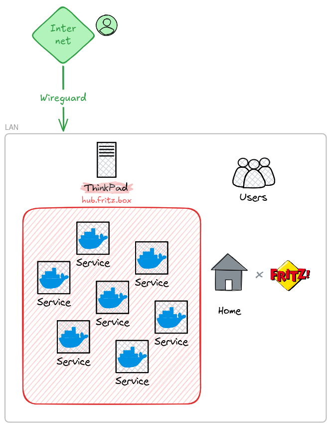

## My Homelab setup

My personal Infra hosting some l33t services. Personal infrastructure running on a ThinkPad, LAN-only. Each service runs
as an isolated Docker Compose stack, version-controlled here.

## Contents

<!-- TOC -->

* [My Homelab setup](#my-homelab-setup)
* [Contents](#contents)
* [Architecture](#architecture)
* [Services & Technologies used](#services--technologies-used)
* [Music Management](#music-management)
* [Backups](#backups)
* [Roadmap](#roadmap)

<!-- TOC -->

## Architecture

- Each service lives under `stacks/<name>/`, with its own `compose.yml`
- Secrets stay out of git: real values live in a local, gitignored `.env` per stack;
  `.env.example` documents every key with placeholder values and defaults.
- Each stack gets its own isolated Docker network by default (Compose's default behavior) - containers can't reach
  across stacks unless explicitly connected. `homepage` is the one exception, deliberately attached to every stack's
  network since it needs visibility into all of them

## Services & Technologies used

- Docker (Compose)
- [Homepage](https://gethomepage.dev/), dashboard for everything below - service status, live stats (library size,
  bookmark counts, sync status), host resource usage
- [Syncthing](https://syncthing.net/), to sync Music, Notes, and stuff
- [Finances](https://github.com/jgoedde/Finances), personal expense tracker, stored in browser
- [MeTube](https://github.com/alexta69/metube), remote YouTube downloader GUI
- [Immich](https://github.com/immich-app/immich), self-hosted photo and video management
- [Karakeep](https://github.com/karakeep-app/karakeep), formerly Hoarder - bookmarking with AI tagging
- [Paperless-ngx](https://github.com/paperless-ngx/paperless-ngx), document management
- [Nginx Proxy Manager](https://nginxproxymanager.com/), reverse proxy with SSL termination. Currently only for the
  Finances app to enable PWA offline support.

## Music Management

Started building my own personal music library, getting off streaming services. Built a nice automation (imo) to get
YouTube Rips - See [music/README](music/README.md). Using [beets](https://beets.io/) to manage the library: auto tag,
audio fingerprinting, and importing YT rips dropped by MeTube. There is a small Flask app to serve some library stats
via a REST API, which is consumed by the Homepage dashboard.

## Backups

Currently manual: `stacks/<service>/backup/backup-<service>.sh` dumps each service's database to its data directory.
Requires manually plugging in an external SSD (cold storage) and running the scripts by hand - see [Roadmap](#roadmap)
for automating this.

## Roadmap

- [X] Move stacks to Version Control (here we are)
- [X] Add dashboard
- [X] [Add automatic redeploy (#2)](https://github.com/jgoedde/homelab/issues/2)
- [ ] Music: Get better quality audios
- [ ] Automate backups (currently manual, cold-storage SSD)
- [ ] Add alerting
