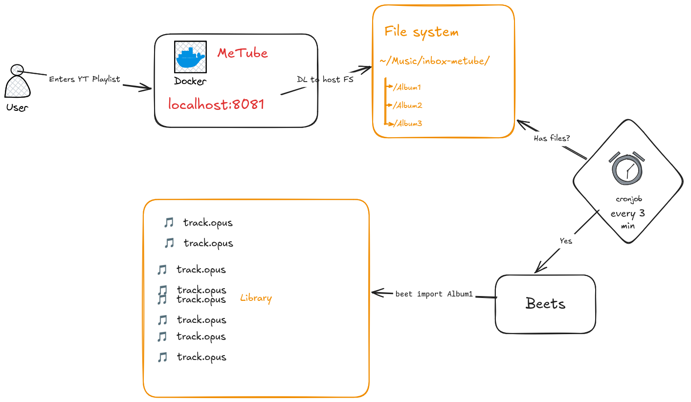

## Music

_Please don't stop the music 🎵_



## Contents

<!-- TOC -->
  * [Music](#music)
  * [Contents](#contents)
  * [Setup](#setup)
<!-- TOC -->

## Setup

Edit crontab to run every x minutes. (See [`crontab`](https://github.com/jgoedde/homelab/blob/main/music/crontab))

    ```shell
    crontab -e
    ```
